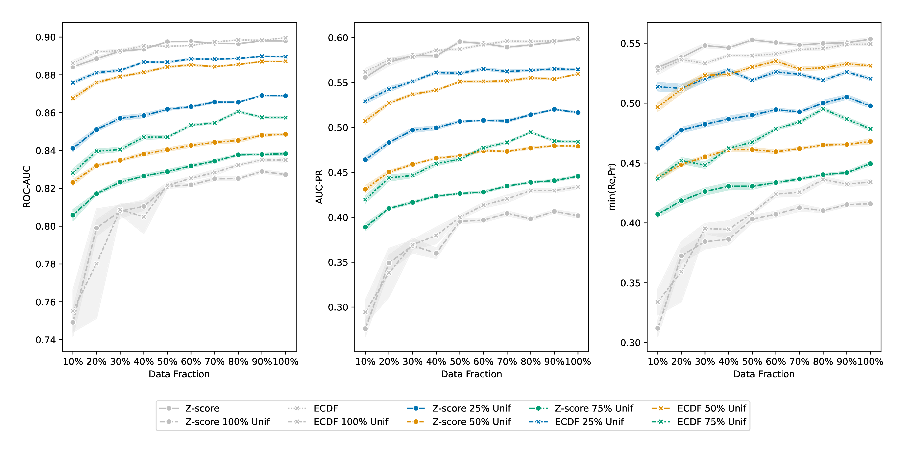

# Transformer model for Biomarkers prediction: Evaluating the impact of ECDF normalization on model robustness in clinical data





This thesis addresses important challenges in predictive analytics in healthcare, specifically focusing on the robustness of machine learning models in the face of outliers and noise within clinical data. Using a transformer-based model and the MIMIC-III dataset, we explore empirical cumulative distribution function (ECDF) normalization as a robust alternative to conventional Z-score normalization. Our findings demonstrate that ECDF normalization significantly enhances model performance, retaining up to 196% more ROC-AUC for mortality prediction under high uniform noise conditions and reducing mean squared error (MSE) by 31% for percentile-based forecasting of time-series values, compared to Z-score normalization. These results suggest that ECDF normalization provides a robust approach for predictive analytics in healthcare, reducing the need for manual outlier removal and thus enhancing scalability for larger datasets. In addition to these methodological advances, significant computational optimizations led to a 30x improvement in training speed, which underscores the model's scalability for real-world applications.

## How to read

The latest `pdf` file is available at [the corresponding release page](https://github.com/mshavliuk/thesis/releases/latest).

Alternatively, you can compile the `pdf` file yourself by executing following command, provided that you have `latexmk` command available, see https://www.latex-project.org/get/ for more info.

```shell
chmod +x ./*.sh

./compile.sh main.tex
```

## License

See [LICENSE.txt](LICENSE.txt)

<a href="https://creativecommons.org/licenses/by-nc-sa/4.0/"></a>
